### How to set up a 3-node cluster on Google Cloud Platform 

- For Windows users, please download and install Git, [link](https://git-scm.com/downloads). I use the `Windows Portable` version.

- Go to the folder and open `git-bash.exe`.

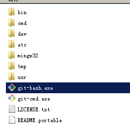

- For all users (Mac/Linux/Windows), please use `ssh-keygen` to generate the key pairs.   

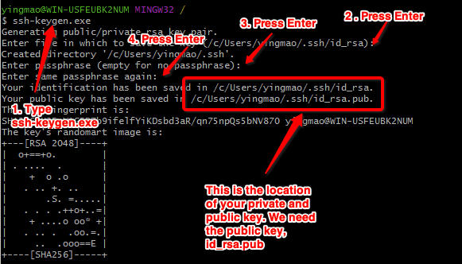

- Go to the folder and copy the `public key`.

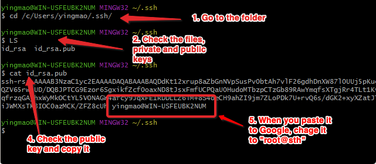

- Go to your `Google Cloud Platform`, Open a Cloud instance in `small` and choose `Ubuntu 16.04 LTS` as your operating system. In addition, you should allow `HTTP` and `HTTPS` traffic.

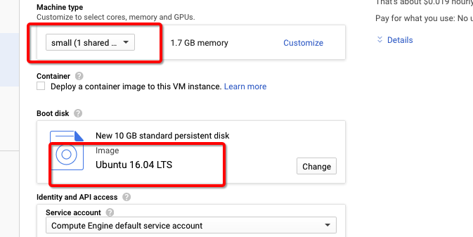
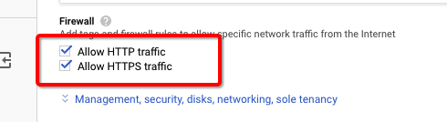

- Go to your instance page, follow the step to add your public key into your instance and save the changes. **`Please check the line breaks when pasting the key from your laptop to Google Cloud. The system may false recognize your key into multiple ones if there are line breaks`**. In addition, you can use `create similar` option to create instance 2 and 3.

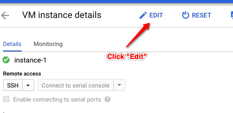
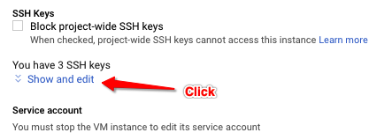
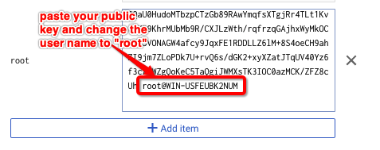
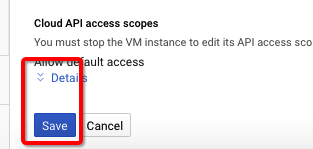

- Go to your `git-bash.exe` or `Terminal` and login to your instance by using its external IP. 

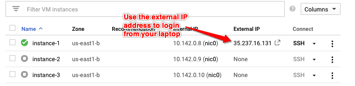
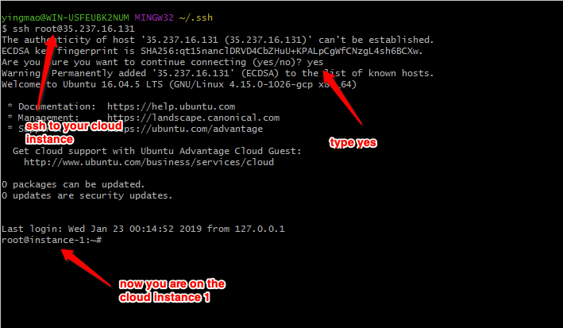

- On your instance 1, please use `ssh-keygen` to generate key pairs for instance 1. 
- Copy the public key of instance 1.
- Create instance 2 and 3 with the same setting of 1. 
- Go to Google Cloud Platform web interface, add the public key of instance 1 to `1, 2 and 3`.
- We want to verify the topology by using the `internal IPs`.

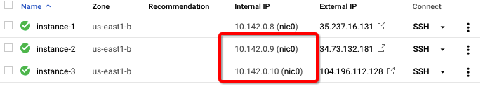

-On instance 1, try to ssh to `itself`, `instance 2` and `instance 3`. 

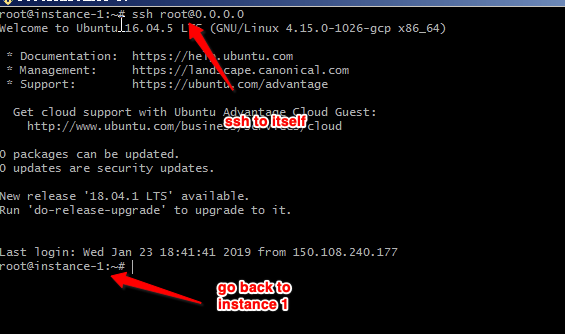
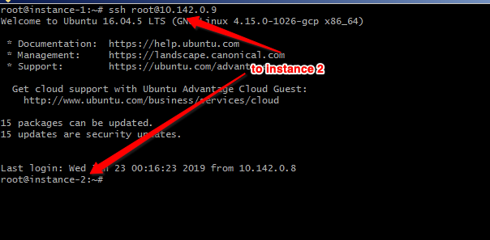
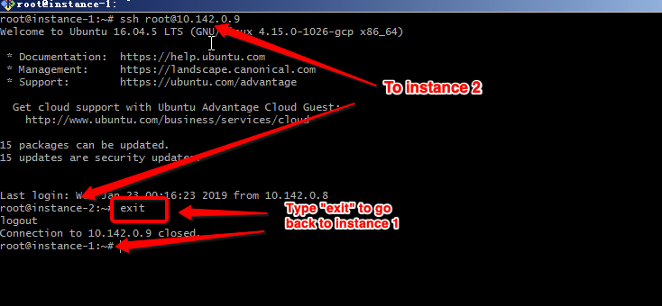
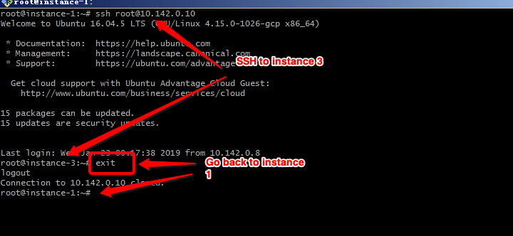

- Now, you have verified the 3 nodes. 

- Go to instance 1 and enter the `root` folder. 

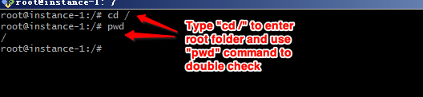

- Download the code from github by using ` git clone https://github.com/yingmao/hdfs-test.git`
 
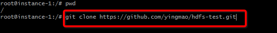

- Go to the hdfs-test folder and change the `master` to the `internal IP` of your instance 1 and `slaves` to the `internal IPs` of your instance 2 and 3. You can use `vi` or `vim` command to enter the `edit` mode.

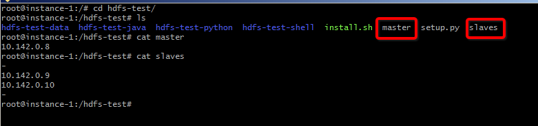

- Finally, run install.sh by using `./install.sh` or `bash install.sh`.

- You can use test.sh in the folder of hdfs-test-shell, hdfs-test-python and hdfs-test-java to test your cluster. 

- Don't forget to **stop or delete** your cloud instances after your experiments.

---